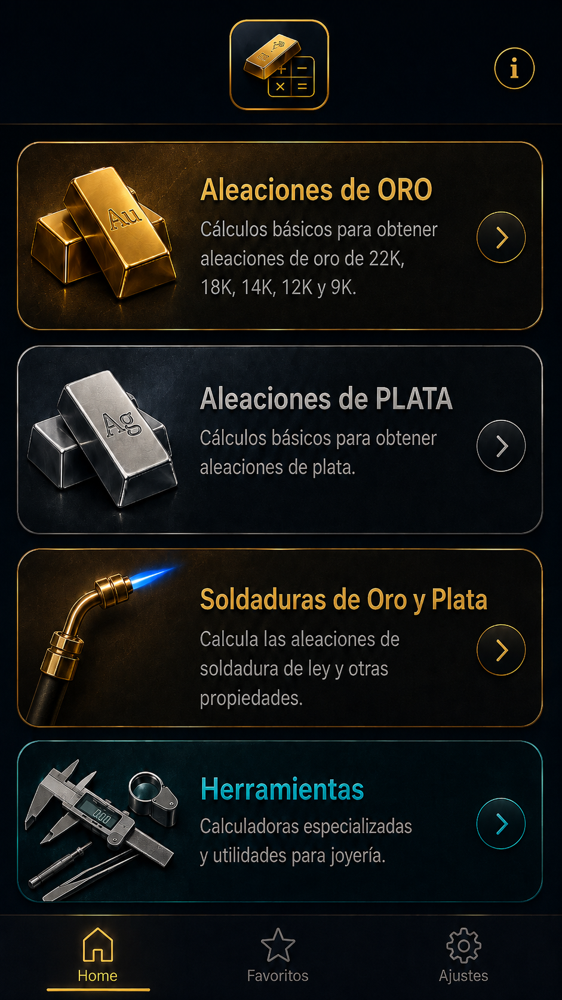
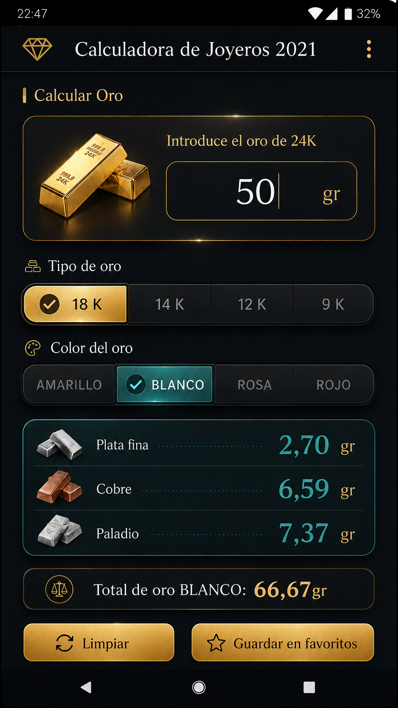
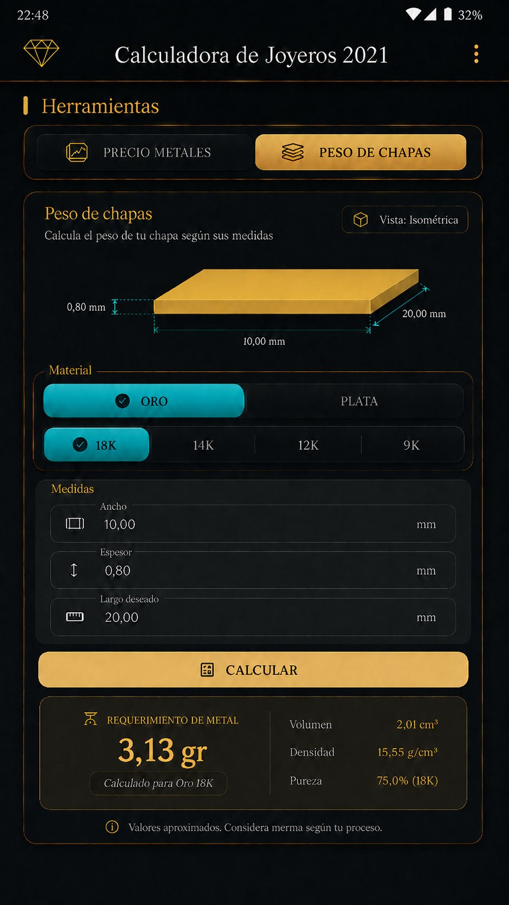
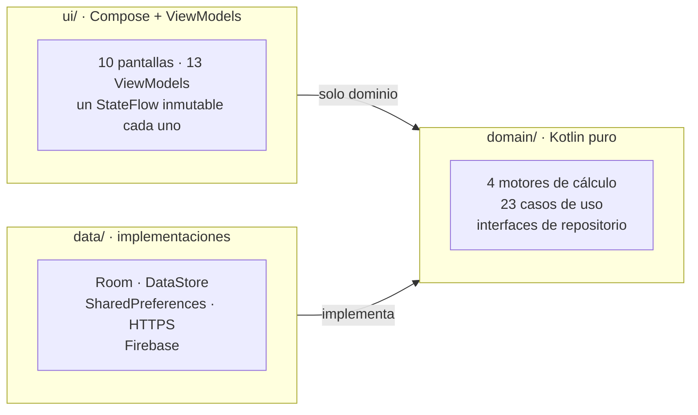

<div align="center">


# Calculadora de Joyeros

**Precisión y cálculo para tu taller**

App Android nativa para el joyero de banco: aleaciones de oro y plata, soldaduras,
peso de chapas y cotización de metales. Sin hojas de cálculo y sin bajar de ley.

<p>
  
  
  
  
  
  
  
</p>

</div>

---

## Qué es

Un joyero que quiere fabricar 30 gramos de oro de 18 K en blanco necesita saber, al gramo, cuánta
plata, cuánto cobre y cuánto paladio echar al crisol. Hoy ese cálculo se hace a mano, con el riesgo
de que la pieza acabe por debajo de la ley que dice el punzón.

**Calculadora de Joyeros** resuelve esos cálculos de taller con aritmética decimal exacta
(`BigDecimal` construido desde literales, sin redondeos intermedios) y con una regla que atraviesa
todo el proyecto: **cuando hay que redondear, se redondea a favor de la ley**, nunca en contra.

La app la firma un desarrollador que además es joyero artesano, y los cuatro documentos técnicos
que hay en [`UI_Plantillas/`](UI_Plantillas) son la fuente de verdad numérica de cada módulo — no
los mockups, no la intuición.

---

## Qué resuelve

| Módulo | Qué hace | Detalle que importa |
|---|---|---|
| **Aleaciones de oro** | Gramos de oro fino 999‰ → liga exacta para 18K, 14K, 12K o 9K en amarillo, blanco, rosa o rojo | 16 recetas color × ley, con reparto de la liga entre plata, cobre y paladio |
| **Aleaciones de plata** | Gramos de plata fina 999‰ → cobre necesario para 950, 925, 900 u 800‰ | El cobre se **trunca** a la milésima: la Ley 17/1985 no admite tolerancia en menos |
| **Soldaduras** | Tres familias (ORO LEY, CLÁSICA, PLATA) × dos modos de entrada, más la preparación de la soldadura BASE | Advertencia de seguridad obligatoria en toda receta con cadmio o zinc |
| **Peso de chapas** | Ancho × largo × espesor → peso, volumen, densidad, pureza y metal fino | 8 materiales con densidades orientativas, e ilustración isométrica que se dibuja con tus medidas |
| **Precio de metales** | Cotización en euros de oro, plata, cobre, paladio y rodio, por gramo, kilo u onza troy | Caché de una hora: cinco consultas por carga y cuota mensual limitada |
| **Favoritos** | Guarda el cálculo que tienes en pantalla y lo reabre con los datos puestos | Se guardan **las entradas, nunca los resultados**: un favorito es una receta, no un recibo |
| **Idioma** | Español, inglés, francés, alemán e italiano, más «Automático» | Cambia al instante, sin recrear la Activity ni perder lo que lleves escrito |

Los cinco cálculos son **reactivos**: no hay botón de «calcular». Todos aceptan coma o punto decimal.

<div align="center">
<table>
<tr>
<td align="center" width="25%"><br><sub><b>Portada</b></sub></td>
<td align="center" width="25%"><br><sub><b>Menú</b></sub></td>
<td align="center" width="25%"><br><sub><b>Aleaciones de oro</b></sub></td>
<td align="center" width="25%"><br><sub><b>Peso de chapas</b></sub></td>
</tr>
</table>
<sub><i>Mockups de diseño de referencia (<code>UI_Plantillas/</code>), no capturas de la app.</i></sub>
</div>

---

## Arquitectura

MVVM con tres capas y una regla de dependencia estricta. `domain/` es Kotlin puro: no importa
`android.*`, ni `androidx.*`, ni Firebase, ni nada de `data/`. Por eso todos los motores de cálculo
se prueban en la JVM, en milisegundos y sin emulador.



| Capa | Contiene | Tiene prohibido importar |
|---|---|---|
| `domain/` | `model/` (motores), `repository/` (interfaces), `usecase/` | `android.*`, `androidx.*`, `com.google.firebase.*`, `data.*` |
| `data/` | `source/remote/`, `source/local/`, `repository/` | `ui.*` |
| `ui/` | `navigation/`, `theme/`, `components/`, una carpeta por pantalla | `data.*` |
| `core/` | `di/` (módulos Koin), `ui/UiState.kt`, `util/` | — |

**Los SDK externos están confinados.** `FirebaseAnalyticsDataSource` es el único fichero del
proyecto que importa `com.google.firebase.*`; todo lo demás pasa por `AnalyticsRepository`. Lo mismo
con la red, la base de datos y las preferencias: cada una detrás de su interfaz de dominio.

### Cuatro motores, y ninguno depende de otro

`domain/model/` tiene cuatro motores de cálculo paralelos —oro, plata, soldaduras y chapas— más un
conversor de precios. **Cada uno lleva sus propias constantes de precisión a propósito**: son
documentos técnicos distintos y ninguno debe depender de un tipo que por dentro lleve el nombre de
otro metal.

- **Oro** — `RecetasOro` es la única fuente de verdad de las 16 recetas color × ley.
- **Plata** — solo la fórmula general: el cobre es el único metal de liga y su documento prohíbe
  tabular coeficientes por ley.
- **Soldaduras** — recetas escaladas con orden de presentación propio, y la mezcla base + oro 18K.
- **Chapas** — `ancho × largo × espesor × densidad / 1000`, **sin una sola división**.

### El redondeo de vista no se unifica

Cada calculadora redondea distinto, y está documentado por qué:

| Pantalla | Política | Motivo |
|---|---|---|
| Oro, soldaduras | `HALF_UP`, 3 decimales | Reparto de liga, sin ley que proteger en la vista |
| **Plata** | **`DOWN` (trunca), 3 decimales** | Con `HALF_UP`, 100 g hacia 950‰ mostrarían 5,158 g de cobre y la ley real caería a 949,999‰ |
| Chapas | `HALF_UP`, 2 decimales | Las densidades son orientativas: un tercer decimal sería precisión aparente |
| Precios | 2 decimales, 4 si el importe < 1 | El cobre por gramo ronda los 0,0089 € |

La pantalla de Favoritos **duplica las cuatro políticas a propósito**, y un test
(`FavoritosParidadFormatoTest`) ejecuta los ViewModels reales de las cinco calculadoras y el de
Favoritos con las mismas entradas, comparando **dígito a dígito**.

---

## Bajo el capó

| Pieza | Elección | Por qué |
|---|---|---|
| **UI** | Jetpack Compose + Material 3, tema *dark luxury* propio | Edge-to-edge; los insets se reparten en `JewelryScaffold`, no en cada pantalla |
| **Navegación** | Navigation Compose con rutas **type-safe** (`@Serializable`) | Cero rutas como `String`; el `favoritoId` viaja nulable, sin valor centinela |
| **Estado** | Un único `StateFlow` inmutable por pantalla | Nada de `LiveData` ni de estado mutable público; el ViewModel no importa Compose |
| **DI** | Koin con DSL manual | `KoinModulesTest` recorre el grafo con `verify()`: si falta una dependencia, falla el test y no el móvil |
| **Favoritos** | Room, una tabla, entradas en JSON e **índice único sobre la firma** | Indexar el JSON dejaría de detectar duplicados en silencio al reordenar un campo del DTO |
| **Preferencias** | DataStore (idioma elegido) | La ausencia de clave es «Automático»; entra en la copia de seguridad |
| **Caché de precios** | `SharedPreferences`, una sola clave con la instantánea | Escritura atómica; excluida del backup por ser dato derivado |
| **Red** | `HttpURLConnection` tras la interfaz `ClienteHttp` | Cinco GET por hora no justifican OkHttp/Retrofit |
| **Concurrencia** | `DispatcherProvider` inyectado, nunca `Dispatchers.IO` directo | Es lo que permite testear con `TestDispatcher` sin tocar `Dispatchers.setMain` |
| **Iconos** | Vectores dibujados a mano en `res/drawable` | `material-icons` salió del classpath en Material 3 1.4.0 y está deprecada |
| **Telemetría** | Firebase Analytics + Crashlytics | Nunca se registran cantidades ni medidas: solo pantallas y elecciones |

---

## Cinco idiomas, y el cambio es instantáneo

`values/` es **español y fuente de verdad**; junto a `values-en`, `values-fr`, `values-de` y
`values-it` suman 229 cadenas, de las que 35 son `translatable="false"` y 194 se traducen.

`ui/idioma/ProveedorIdioma` envuelve al `NavHost` y provee `LocalContext` y `LocalConfiguration`;
`stringResource` se recalcula solo. **No se recrea la Activity**, así que el joyero no pierde lo que
lleve escrito. `TraduccionesTest` parsea los cinco ficheros y falla si falta o sobra una clave, si se
traduce algo intraducible o si cambian los `%n$s`; `./gradlew :app:lint` es la segunda red
(`MissingTranslation` / `ExtraTranslation`).

> [!NOTE]
> El formato de las cifras **no** se localiza: coma decimal determinista en los cinco idiomas. Es
> deuda conocida, junto con la moneda cableada al euro.

---

## Puesta en marcha

### Requisitos

- **JDK 17** — el que trae Android Studio sirve.
- **Android SDK** con `compileSdk 37` y *build-tools* 37.0.0.
- Un proyecto de Firebase y, opcionalmente, una credencial de RapidAPI.

### 1 · Clonar y configurar Firebase

```bash
git clone https://github.com/jrcosio/calculadoradejoyeros2026.git
cd calculadoradejoyeros2026
```

`app/google-services.json` **está en `.gitignore` y no se commitea nunca**: un clon nuevo no compila
hasta que lo descargues de la consola de Firebase y lo dejes en `app/`.

> [!IMPORTANT]
> El `applicationId` es `com.jrblanco.calculadoradejoyeros2021` aunque el repo se llame `...2026`.
> El `google-services.json` está registrado contra ese *package*: cambiarlo obliga a dar de alta una
> app Android nueva en Firebase.

### 2 · Credencial de cotizaciones (opcional)

La pantalla de precios usa **Metal Sentinel** vía RapidAPI. Añade la clave en `local.properties`
(ignorado por git), o pásala como variable de entorno `RAPIDAPI_KEY` en CI:

```properties
RAPIDAPI_KEY=tu_clave_aqui
```

Sin ella la build avisa y la pantalla muestra «servicio no configurado» **sin tocar la red**; el
resto de la app funciona igual. Es una integración de prototipo: la clave es extraíble del APK y la
cuota gratuita (15 000 peticiones/mes, 5 por carga) no da para una app pública.

### 3 · Compilar

`java` no suele estar en el PATH en macOS, así que exporta primero el JDK de Android Studio:

```bash
export JAVA_HOME="/Applications/Android Studio.app/Contents/jbr/Contents/Home"

./gradlew :app:assembleDebug     # APK de depuración
./gradlew :app:installDebug      # instalar en el dispositivo conectado
```

---

## Tests y calidad

**565 tests**: 440 unitarios en la JVM y 125 instrumentados. Todo ViewModel y todo caso de uso
llevan test — es principio de constitución, no una costumbre.

```bash
./gradlew :app:testDebugUnitTest              # unitarios (JVM), rápidos
./gradlew :app:lint                           # puerta de calidad: traducciones
./gradlew :app:connectedDebugAndroidTest      # instrumentados: Compose + el DAO de favoritos

# un solo test o una sola clase
./gradlew :app:testDebugUnitTest --tests "*OroViewModelTest"
./gradlew :app:testDebugUnitTest --tests "*OroViewModelTest.calcula*"
```

Los XML de resultados quedan en `app/build/test-results/testDebugUnitTest/`: se leen más rápido que
el HTML cuando algo falla.

Guardianes que conviene conocer:

- **`KoinModulesTest`** — recorre el grafo de dependencias con `verify()`.
- **`TraduccionesTest`** — compara clave a clave los cinco `strings.xml`.
- **`FavoritosParidadFormatoTest`** — compara dígito a dígito Favoritos contra las cinco calculadoras.
- **`CodificadorFavoritoTest`** — test dorado con las siete firmas literales.
- Los instrumentados **anclan el idioma** (`ui/EntornoDeTest.kt`) en lugar de heredarlo del emulador.

Herramientas: JUnit 4, MockK, Turbine, `kotlinx-coroutines-test`, Compose UI Test y Espresso.

---

## Estructura del repositorio

```
calculadoradejoyeros2021/
├── app/src/main/java/…/
│   ├── core/            di/ (módulos Koin) · util/ (Reloj, DispatcherProvider, IdiomaSistema)
│   ├── data/            source/remote/ · source/local/ · repository/
│   ├── domain/          model/ (motores) · repository/ (interfaces) · usecase/ (23)
│   └── ui/              navigation/ · theme/ · components/ · una carpeta por pantalla
├── app/schemas/         esquema exportado de Room — se commitea
├── app/src/main/keepRules/   reglas de R8 (AGP 9 las recoge solas)
├── specs/               las 9 features, con spec · plan · tasks · research
├── UI_Plantillas/       mockups y los 4 documentos técnicos: la fuente de verdad numérica
├── .specify/memory/     constitution.md — la norma del proyecto
├── gradle/libs.versions.toml   única fuente de verdad de versiones
└── CLAUDE.md            guía operativa para agentes de código
```

Pantallas de referencia al crear una nueva: `ui/home/` marca la forma, `ui/plata/` es la calculadora
más corta (se pinta entera con `ui/components/`) y `ui/herramientas/` es el ejemplo de una ruta con
varios sub-paquetes y varios ViewModels.

---

## Cómo se construye: Spec-Driven Development

Toda feature recorre el ciclo completo de **GitHub Spec Kit** antes de tocar código de producto:

```
/speckit-specify  →  /speckit-plan  →  /speckit-tasks  →  /speckit-implement
```

No se escribe código sin un `tasks.md` aprobado en `specs/<NNN>-<slug>/`. La spec dice **qué** y
**por qué**, nunca **cómo**: ni nombres de clase, ni de librería, ni de API. Si durante la
implementación aparece un requisito que la spec no cubre, se para y se actualiza la spec.

| # | Feature | Qué estrenó |
|---|---|---|
| 001 | [Pantalla de inicio](specs/001-pantalla-inicio) | El sistema de diseño *dark luxury* |
| 002 | [Home (menú)](specs/002-home-menu) | Navegación type-safe y el armazón de pantalla |
| 003 | [Información](specs/003-info-acerca-de) | Apertura de enlaces externos |
| 004 | [Aleaciones de oro](specs/004-aleaciones-oro) | El primer motor de dominio y el formulario reactivo |
| 005 | [Aleaciones de plata](specs/005-aleaciones-plata) | `ui/components/`: lo privado se hace compartido |
| 006 | [Soldaduras](specs/006-soldaduras-joyeria) | Dos pantallas en un paquete y un caso de uso sin UI |
| 007 | [Herramientas](specs/007-herramientas) | Red, corrutinas, caché y el primer `Canvas` — sin dependencias nuevas |
| 008 | [Idioma](specs/008-ajustes-idioma) | Los cinco idiomas y el proveedor que no recrea nada |
| 009 | [Favoritos](specs/009-favoritos) | Room, KSP, el primer diálogo y la firma de duplicados |

Las normas no negociables viven en [`.specify/memory/constitution.md`](.specify/memory/constitution.md).
Los commits siguen **Conventional Commits**, en español.

---

## Stack

<div align="center">

| | |
|---|---|
| **Lenguaje** | Kotlin 2.2.10 *(la fija el Kotlin integrado de AGP 9.3.1)* |
| **UI** | Jetpack Compose · Compose BOM 2026.08.00 · Material 3 |
| **Arquitectura** | MVVM · Coroutines 1.11.0 · StateFlow |
| **DI** | Koin 4.2.2 (BoM) |
| **Persistencia** | Room 2.8.4 + KSP 2.3.11 · DataStore Preferences 1.2.1 |
| **Serialización** | kotlinx.serialization 1.9.0 |
| **Backend** | Firebase BoM 34.18.0 — Analytics + Crashlytics |
| **Build** | AGP 9.3.1 · Gradle · `compileSdk 37` / `targetSdk 36` / `minSdk 24` |

</div>

Todas las versiones pasan por [`gradle/libs.versions.toml`](gradle/libs.versions.toml). Cuando hay
BoM se usa, y los artefactos se declaran sin versión.

---

## Builds de release

`release` lleva **R8 activado** y sube el *mapping* a Crashlytics dentro de `assembleRelease`, así
que los stack traces de producción llegan desofuscados con fichero y número de línea. Las reglas de
R8 viven en `app/src/main/keepRules/*.keep`; en este proyecto no existe `proguard-rules.pro`.

> [!WARNING]
> Todavía **no hay `signingConfig` de release**: `assembleRelease` produce
> `app-release-unsigned.apk`. Hace falta un keystore antes de poder publicar.

---

## Licencia

Publicado bajo la **GNU General Public License v3.0**. Ver [LICENSE](LICENSE).

<div align="center">
<br>
<sub>Desarrollado por <b>José Ramón Blanco</b> — desarrollador y joyero artesano</sub>
<br>
<sub><i>Precisión y cálculo para tu taller</i></sub>
</div>
