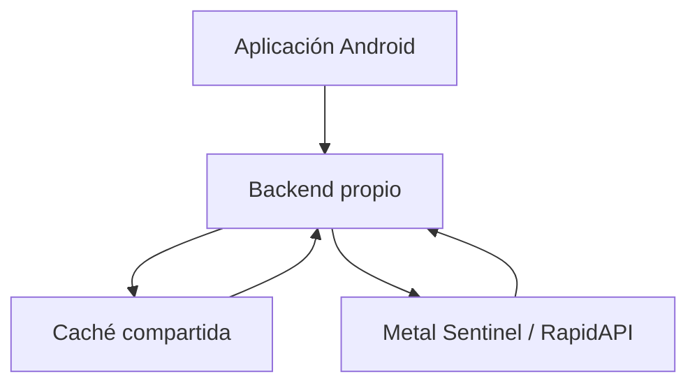

# Guía de integración: precios de metales en Android con Kotlin y Jetpack Compose

> Proyecto: **Calculadora de Joyeros**.  
> Objetivo: consultar y mostrar cotizaciones en euros de oro, plata, cobre, paladio y rodio.  
> Destinatarios: desarrolladores Android, Claude Code, Codex y otros agentes de programación.  
> Fecha de revisión documental: 25 de agosto de 2026.

---

## 1. Objetivo funcional

Implementar una pantalla de cotizaciones que:

1. Consulte los cinco metales en euros.
2. Muestre el símbolo, el nombre y el precio facilitado por el proveedor.
3. Muestre el precio por gramo cuando la unidad original esté confirmada y la conversión sea correcta.
4. Permita refrescar manualmente.
5. Conserve los resultados disponibles aunque alguno de los metales falle.
6. Evite consultas innecesarias mediante caché.
7. No revele ni registre la credencial de RapidAPI.
8. Pueda migrar a un backend propio sin rehacer la interfaz.

### 1.1. Metales admitidos

| Metal | Símbolo de la API | Símbolo químico mostrado |
| --- | --- | --- |
| Oro | `AU` | `Au` |
| Plata | `AG` | `Ag` |
| Cobre | `CU` | `Cu` |
| Paladio | `PD` | `Pd` |
| Rodio | `RH` | `Rh` |

Los códigos enviados al proveedor deben ir en mayúsculas. La representación química de la interfaz puede utilizar mayúscula y minúscula.

---

## 2. Advertencia: existen dos variantes del endpoint

El ejemplo facilitado inicialmente utiliza:

```text
GET https://metal-sentinel.p.rapidapi.com/metal-quote?symbol=AU&currency=EUR
```

Sin embargo, la documentación pública del proveedor muestra actualmente:

```text
GET https://metal-sentinel.p.rapidapi.com/api/metal-quote?metal=AU&currency=EUR
```

Las diferencias son:

| Elemento | Ejemplo inicial | Documentación pública |
| --- | --- | --- |
| Ruta | `/metal-quote` | `/api/metal-quote` |
| Parámetro del metal | `symbol` | `metal` |
| Moneda | `currency=EUR` | `currency=EUR` |

**Acción obligatoria antes de implementar:** comprobar en el panel concreto de RapidAPI qué ruta y qué nombre de parámetro responden correctamente con la suscripción contratada.

Esta guía implementa por defecto la variante documentada por el proveedor: `/api/metal-quote?metal=AU`. Más adelante se incluye el cambio necesario para usar la variante `/metal-quote?symbol=AU`.

No debe programarse una cadena de reintentos que consulte automáticamente ambas rutas en cada carga: duplicaría solicitudes y podría consumir la cuota contratada.

### 2.1. Cabeceras

```http
x-rapidapi-host: metal-sentinel.p.rapidapi.com
x-rapidapi-key: TU_CLAVE_RAPIDAPI
Accept: application/json
```

En una petición `GET` sin cuerpo, `Content-Type: application/json` no suele ser necesario. `Accept: application/json` expresa mejor el formato esperado. Añadir `Content-Type` solo si el proveedor lo exige expresamente.

### 2.2. Parámetro `timestamp`

El ejemplo original incluye opcionalmente:

```text
timestamp=1771526820
```

Tratarlo como un posible Unix timestamp expresado en segundos, **solo si la documentación específica del plan confirma que ese endpoint lo admite y explica su significado**. No está verificado que sirva para consultar históricos en esa ruta.

Para precios actuales, omitir el parámetro. Para históricos, comprobar primero el endpoint `/api/metal-history` documentado por el proveedor.

---

## 3. Seguridad: no incluir la clave de RapidAPI en una app publicada

### 3.1. Problema

Una credencial incluida en código Kotlin, `BuildConfig`, recursos, variables compiladas o una librería nativa termina estando disponible en el APK/AAB distribuido, directa o indirectamente. Un tercero puede extraerla y consumir la cuota.

Guardar el valor en `local.properties` únicamente evita subirlo al repositorio: **no evita que aparezca dentro de la aplicación compilada**.

Android Keystore puede proteger material generado o almacenado localmente, pero no convierte una clave compartida distribuida con todas las instalaciones en un secreto seguro.

### 3.2. Arquitectura de producción recomendada



La aplicación llama a un endpoint propio, por ejemplo:

```text
GET https://api.tudominio.com/v1/metals/quotes?currency=EUR
```

El backend:

- Custodia la clave de RapidAPI.
- Consulta los cinco metales.
- Normaliza la unidad y la estructura JSON.
- Agrupa la respuesta en una sola llamada desde Android.
- Aplica una caché compartida para todos los usuarios.
- Establece límites, autenticación, métricas y control de costes.

**La integración directa desde Android expuesta en esta guía sirve para prototipos, desarrollo interno o pruebas controladas. Para una app pública debe sustituirse por el backend.**

### 3.3. Credencial previamente compartida

Si una clave real ya se pegó en conversaciones, incidencias, repositorios o documentación compartida, tratarla como potencialmente expuesta y regenerarla o rotarla en RapidAPI antes de distribuir la aplicación.

---

## 4. Estructura Android propuesta

```text
app/src/main/java/com/ejemplo/calculadorajoyeros/
  data/
    remote/
      MetalApiService.kt
      MetalNetworkModule.kt
      MetalQuoteParser.kt
    repository/
      MetalRepository.kt
  domain/
    model/
      MetalType.kt
      MetalQuote.kt
      MetalLoadResult.kt
      QuoteUnit.kt
    pricing/
      MetalPriceConversions.kt
  ui/
    metals/
      MetalsUiState.kt
      MetalsViewModel.kt
      MetalsScreen.kt
  MainActivity.kt
```

Sustituir `com.ejemplo.calculadorajoyeros` por el namespace real del proyecto. Si existe Hilt, Koin u otro sistema de inyección, integrarlo respetando la arquitectura existente.

---

## 5. Permiso de Internet

En `app/src/main/AndroidManifest.xml`:

```xml
<manifest xmlns:android="http://schemas.android.com/apk/res/android">

    <uses-permission android:name="android.permission.INTERNET" />

    <application
        android:usesCleartextTraffic="false">

        <!-- Actividades y resto de configuración. -->

    </application>
</manifest>
```

`INTERNET` es un permiso normal: no requiere solicitar autorización en tiempo de ejecución. Utilizar siempre HTTPS.

Si el proyecto ya define `<application>`, añadir únicamente el atributo necesario; no crear un segundo bloque.

---

## 6. Dependencias Gradle

En `app/build.gradle.kts`:

```kotlin
import java.util.Properties

val rapidApiProperties = Properties().apply {
    val propertiesFile = rootProject.file("local.properties")

    if (propertiesFile.exists()) {
        propertiesFile.inputStream().use(::load)
    }
}

val rapidApiKey = rapidApiProperties
    .getProperty("RAPIDAPI_KEY")
    .orEmpty()
    .replace("\\", "\\\\")
    .replace("\"", "\\\"")

android {
    buildFeatures {
        compose = true
        buildConfig = true
    }

    defaultConfig {
        buildConfigField(
            "String",
            "RAPIDAPI_KEY",
            "\"$rapidApiKey\""
        )
    }
}

dependencies {
    implementation("com.squareup.retrofit2:retrofit:3.0.0")
    implementation("com.squareup.retrofit2:converter-gson:3.0.0")

    // Mantener ambas dependencias OkHttp alineadas mediante su BOM.
    implementation(platform("com.squareup.okhttp3:okhttp-bom:5.5.0"))
    implementation("com.squareup.okhttp3:okhttp")
    implementation("com.squareup.okhttp3:logging-interceptor")

    implementation("androidx.lifecycle:lifecycle-runtime-compose:2.10.0")
    implementation("androidx.lifecycle:lifecycle-viewmodel-compose:2.10.0")
    implementation("androidx.lifecycle:lifecycle-viewmodel-ktx:2.10.0")
}
```

Las dependencias anteriores complementan las de Compose y Material 3 ya existentes. Antes de añadirlas, revisar el catálogo de versiones del proyecto y evitar duplicados. Comprobar también la compatibilidad del Kotlin y del Android Gradle Plugin existentes con Retrofit 3 y OkHttp 5; si el proyecto mantiene versiones anteriores, conservar versiones compatibles y el mismo diseño.

Si la compilación presenta conflictos por forzar OkHttp 5 con dependencias antiguas, alinear Retrofit y OkHttp con el catálogo del proyecto en lugar de mezclar versiones incompatibles.

### 6.1. Credencial local para desarrollo

En `local.properties`:

```properties
RAPIDAPI_KEY=TU_CLAVE_RAPIDAPI_DE_DESARROLLO
```

Comprobar que Git ignora este archivo:

```gitignore
local.properties
```

En CI, proporcionar el valor mediante secretos del proveedor de integración continua. En producción, eliminar la dependencia de esta clave en Android y consultar el backend propio.

---

## 7. Modelos de dominio

### 7.1. `MetalType.kt`

```kotlin
package com.ejemplo.calculadorajoyeros.domain.model

enum class MetalType(
    val apiSymbol: String,
    val displaySymbol: String,
    val displayName: String
) {
    GOLD("AU", "Au", "Oro"),
    SILVER("AG", "Ag", "Plata"),
    COPPER("CU", "Cu", "Cobre"),
    PALLADIUM("PD", "Pd", "Paladio"),
    RHODIUM("RH", "Rh", "Rodio")
}
```

### 7.2. `QuoteUnit.kt`

```kotlin
package com.ejemplo.calculadorajoyeros.domain.model

enum class QuoteUnit(val displayLabel: String) {
    GRAM("g"),
    KILOGRAM("kg"),
    TROY_OUNCE("oz t"),
    UNKNOWN("unidad no confirmada")
}
```

### 7.3. `MetalQuote.kt`

```kotlin
package com.ejemplo.calculadorajoyeros.domain.model

import java.math.BigDecimal

data class MetalQuote(
    val metal: MetalType,
    val currency: String,
    val sourcePrice: BigDecimal,
    val sourceUnit: QuoteUnit,
    val pricePerGram: BigDecimal?,
    val updatedAtEpochSeconds: Long?,
    val fetchedAtEpochMillis: Long = System.currentTimeMillis()
)
```

### 7.4. `MetalLoadResult.kt`

```kotlin
package com.ejemplo.calculadorajoyeros.domain.model

sealed interface MetalLoadResult {
    val metal: MetalType

    data class Success(
        override val metal: MetalType,
        val quote: MetalQuote
    ) : MetalLoadResult

    data class Error(
        override val metal: MetalType,
        val message: String
    ) : MetalLoadResult
}
```

---

## 8. Retrofit: declaración del endpoint

### 8.1. `MetalApiService.kt`

```kotlin
package com.ejemplo.calculadorajoyeros.data.remote

import com.google.gson.JsonObject
import retrofit2.http.GET
import retrofit2.http.Query

interface MetalApiService {

    @GET("api/metal-quote")
    suspend fun getMetalQuote(
        @Query("metal") metal: String,
        @Query("currency") currency: String = "EUR"
    ): JsonObject
}
```

Se utiliza `JsonObject` provisionalmente porque la documentación pública únicamente permite verificar la existencia de una respuesta con `ID` y `results`, pero no muestra el objeto completo ni confirma los nombres de los campos del precio, su unidad y la fecha.

**No crear un DTO con campos inventados.** Después de capturar una respuesta real y anonimizada, sustituir `JsonObject` por modelos tipados que reflejen exactamente el contrato.

### 8.2. Variante para la ruta del ejemplo inicial

Si el panel de RapidAPI confirma que la suscripción utiliza el formato inicial, sustituir únicamente la interfaz anterior por:

```kotlin
interface MetalApiService {

    @GET("metal-quote")
    suspend fun getMetalQuote(
        @Query("symbol") metal: String,
        @Query("currency") currency: String = "EUR"
    ): JsonObject
}
```

El repositorio, el ViewModel y la interfaz Compose permanecen iguales.

### 8.3. `timestamp` opcional cuando esté documentado

```kotlin
@GET("api/metal-quote")
suspend fun getMetalQuote(
    @Query("metal") metal: String,
    @Query("currency") currency: String = "EUR",
    @Query("timestamp") timestampEpochSeconds: Long? = null
): JsonObject
```

Retrofit omite los parámetros `@Query` cuyo valor es `null`. Añadir esta variante únicamente después de comprobar que el endpoint admite ese parámetro.

---

## 9. Cliente HTTP e interceptores

### 9.1. `MetalNetworkModule.kt`

```kotlin
package com.ejemplo.calculadorajoyeros.data.remote

import com.ejemplo.calculadorajoyeros.BuildConfig
import okhttp3.OkHttpClient
import okhttp3.logging.HttpLoggingInterceptor
import retrofit2.Retrofit
import retrofit2.converter.gson.GsonConverterFactory
import java.util.concurrent.TimeUnit

object MetalNetworkModule {

    private const val BASE_URL = "https://metal-sentinel.p.rapidapi.com/"
    private const val RAPID_API_HOST = "metal-sentinel.p.rapidapi.com"

    private val loggingInterceptor = HttpLoggingInterceptor().apply {
        redactHeader("x-rapidapi-key")

        level = if (BuildConfig.DEBUG) {
            HttpLoggingInterceptor.Level.BASIC
        } else {
            HttpLoggingInterceptor.Level.NONE
        }
    }

    private val client: OkHttpClient by lazy {
        OkHttpClient.Builder()
            .connectTimeout(15, TimeUnit.SECONDS)
            .readTimeout(20, TimeUnit.SECONDS)
            .writeTimeout(20, TimeUnit.SECONDS)
            .addInterceptor { chain ->
                check(BuildConfig.RAPIDAPI_KEY.isNotBlank()) {
                    "Falta RAPIDAPI_KEY en local.properties"
                }

                val authenticatedRequest = chain.request()
                    .newBuilder()
                    .header("x-rapidapi-host", RAPID_API_HOST)
                    .header("x-rapidapi-key", BuildConfig.RAPIDAPI_KEY)
                    .header("Accept", "application/json")
                    .build()

                chain.proceed(authenticatedRequest)
            }
            .addInterceptor(loggingInterceptor)
            .build()
    }

    val api: MetalApiService by lazy {
        Retrofit.Builder()
            .baseUrl(BASE_URL)
            .client(client)
            .addConverterFactory(GsonConverterFactory.create())
            .build()
            .create(MetalApiService::class.java)
    }
}
```

Notas:

- `.baseUrl(...)` debe terminar en `/`.
- Reutilizar una única instancia de `OkHttpClient`.
- No registrar cabeceras completas ni la clave.
- `redactHeader(...)` añade protección adicional si el nivel de registro cambia posteriormente.
- Las funciones `suspend` de Retrofit no deben invocarse directamente desde el cuerpo de un composable.

---

## 10. Estructura real del JSON: validar antes de mapear

La documentación pública enseña una estructura parcial parecida a:

```json
{
  "ID": 1787653387,
  "results": [
    {}
  ]
}
```

El `{}` anterior es únicamente un marcador: **no representa la respuesta completa**. Todavía hay que confirmar:

1. Dónde aparece el precio.
2. Si el precio llega como número o como cadena.
3. Si la unidad llega como `g`, `kg`, `oz t` u otro formato.
4. Qué significa exactamente una posible etiqueta `oz`.
5. Dónde aparece la moneda.
6. Si existe fecha y si se expresa en segundos, milisegundos o ISO-8601.
7. Si `results` puede contener varios elementos.
8. Qué devuelve el proveedor para errores, mercados cerrados o símbolos no disponibles.

Capturar una respuesta desde el panel RapidAPI o mediante una prueba local, omitiendo la clave en registros, capturas y documentación.

---

## 11. Conversión monetaria y unidades

### 11.1. Fórmulas

```text
1 onza troy = 31,1034768 gramos

€/g = €/onza troy ÷ 31,1034768

€/g = €/kg ÷ 1.000

€/kg = €/g × 1.000
```

No confundir una onza troy con una onza avoirdupois. No asumir que todos los metales comparten unidad: el cobre y otros metales industriales pueden presentarse con convenciones diferentes.

Usar `BigDecimal` para cálculos monetarios. Un precio con unidad desconocida se puede mostrar como valor de origen, pero **no debe convertirse a €/g**.

### 11.2. `MetalPriceConversions.kt`

```kotlin
package com.ejemplo.calculadorajoyeros.domain.pricing

import com.ejemplo.calculadorajoyeros.domain.model.QuoteUnit
import java.math.BigDecimal
import java.math.RoundingMode

object MetalPriceConversions {

    private val gramsPerTroyOunce = BigDecimal("31.1034768")
    private val gramsPerKilogram = BigDecimal("1000")

    fun toPricePerGram(
        amount: BigDecimal,
        unit: QuoteUnit,
        scale: Int = 8
    ): BigDecimal? {
        require(amount.signum() >= 0) {
            "El precio del metal no puede ser negativo"
        }

        return when (unit) {
            QuoteUnit.GRAM -> amount.setScale(scale, RoundingMode.HALF_UP)

            QuoteUnit.KILOGRAM -> amount.divide(
                gramsPerKilogram,
                scale,
                RoundingMode.HALF_UP
            )

            QuoteUnit.TROY_OUNCE -> amount.divide(
                gramsPerTroyOunce,
                scale,
                RoundingMode.HALF_UP
            )

            QuoteUnit.UNKNOWN -> null
        }
    }
}
```

Mantener suficiente precisión internamente y redondear solo al mostrar. Para aleaciones y presupuestos de joyería, definir por separado las reglas comerciales de redondeo.

---

## 12. Parser provisional y defensivo

### 12.1. `MetalQuoteParser.kt`

```kotlin
package com.ejemplo.calculadorajoyeros.data.remote

import com.ejemplo.calculadorajoyeros.domain.model.MetalQuote
import com.ejemplo.calculadorajoyeros.domain.model.MetalType
import com.ejemplo.calculadorajoyeros.domain.model.QuoteUnit
import com.ejemplo.calculadorajoyeros.domain.pricing.MetalPriceConversions
import com.google.gson.JsonElement
import com.google.gson.JsonObject
import java.math.BigDecimal

object MetalQuoteParser {

    fun parse(
        response: JsonObject,
        metal: MetalType,
        requestedCurrency: String
    ): MetalQuote {
        val payload = response.getAsJsonArray("results")
            ?.firstOrNull()
            ?.takeIf(JsonElement::isJsonObject)
            ?.asJsonObject
            ?: response

        val priceField = listOf(
            "price_per_gram",
            "price_per_kg",
            "spot_price",
            "price"
        ).firstOrNull { key ->
            payload.has(key) && !payload.get(key).isJsonNull
        } ?: error(
            "La respuesta no contiene un campo de precio conocido. " +
                "Revisar el JSON real y actualizar MetalQuoteParser."
        )

        val sourcePrice = payload.get(priceField)
            .asString
            .let(::BigDecimal)

        val explicitUnit = payload.stringOrNull("unit")
            ?: payload.stringOrNull("price_unit")

        val sourceUnit = when (priceField) {
            "price_per_gram" -> QuoteUnit.GRAM
            "price_per_kg" -> QuoteUnit.KILOGRAM
            else -> parseUnit(explicitUnit)
        }

        val returnedCurrency = payload.stringOrNull("currency")
            ?: response.stringOrNull("currency")
            ?: requestedCurrency

        check(returnedCurrency.equals(requestedCurrency, ignoreCase = true)) {
            "La API devolvió $returnedCurrency cuando se solicitó $requestedCurrency"
        }

        val updatedAt = payload.longOrNull("timestamp")
            ?: payload.longOrNull("updated_at")
            ?: response.longOrNull("timestamp")

        return MetalQuote(
            metal = metal,
            currency = returnedCurrency.uppercase(),
            sourcePrice = sourcePrice,
            sourceUnit = sourceUnit,
            pricePerGram = MetalPriceConversions.toPricePerGram(
                amount = sourcePrice,
                unit = sourceUnit
            ),
            updatedAtEpochSeconds = normalizeEpochSeconds(updatedAt)
        )
    }

    private fun parseUnit(value: String?): QuoteUnit {
        val normalized = value
            ?.trim()
            ?.lowercase()
            ?.replace('-', '_')
            ?.replace(' ', '_')

        return when (normalized) {
            "g", "gram", "grams", "gramo", "gramos" -> QuoteUnit.GRAM

            "kg", "kilogram", "kilograms", "kilogramo", "kilogramos" -> {
                QuoteUnit.KILOGRAM
            }

            "ozt", "oz_t", "troy_ounce", "troy_ounces", "onza_troy" -> {
                QuoteUnit.TROY_OUNCE
            }

            // "oz" es ambiguo hasta que el proveedor confirme que es onza troy.
            else -> QuoteUnit.UNKNOWN
        }
    }

    private fun JsonObject.stringOrNull(name: String): String? {
        return get(name)
            ?.takeUnless(JsonElement::isJsonNull)
            ?.asString
    }

    private fun JsonObject.longOrNull(name: String): Long? {
        return stringOrNull(name)?.toLongOrNull()
    }

    private fun normalizeEpochSeconds(value: Long?): Long? {
        return when {
            value == null -> null
            value >= 1_000_000_000_000L -> value / 1_000L
            else -> value
        }
    }
}
```

Este parser es una adaptación provisional y deliberadamente estricta. Los nombres `price`, `spot_price`, `price_per_gram`, `unit` y `timestamp` son hipótesis defensivas, no campos confirmados del proveedor. Deben reemplazarse por el contrato exacto tras observar una respuesta real.

Si `results` devuelve varios elementos, no asumir automáticamente que el primero corresponde al metal solicitado: seleccionar el elemento correcto utilizando el campo de símbolo confirmado en la respuesta.

---

## 13. Repositorio: concurrencia, errores parciales y caché

### 13.1. `MetalRepository.kt`

```kotlin
package com.ejemplo.calculadorajoyeros.data.repository

import com.ejemplo.calculadorajoyeros.data.remote.MetalApiService
import com.ejemplo.calculadorajoyeros.data.remote.MetalQuoteParser
import com.ejemplo.calculadorajoyeros.domain.model.MetalLoadResult
import com.ejemplo.calculadorajoyeros.domain.model.MetalQuote
import com.ejemplo.calculadorajoyeros.domain.model.MetalType
import kotlinx.coroutines.CancellationException
import kotlinx.coroutines.async
import kotlinx.coroutines.awaitAll
import kotlinx.coroutines.supervisorScope
import kotlinx.coroutines.sync.Mutex
import kotlinx.coroutines.sync.withLock
import retrofit2.HttpException
import java.io.IOException

class MetalRepository(
    private val api: MetalApiService,
    private val cacheTtlMillis: Long = 15 * 60 * 1_000L,
    private val clock: () -> Long = System::currentTimeMillis
) {

    private val cacheMutex = Mutex()
    private val cache = mutableMapOf<CacheKey, CachedQuote>()

    suspend fun getAllQuotes(
        currency: String = "EUR",
        forceRefresh: Boolean = false
    ): List<MetalLoadResult> = supervisorScope {
        MetalType.entries.map { metal ->
            async {
                try {
                    MetalLoadResult.Success(
                        metal = metal,
                        quote = getQuote(metal, currency, forceRefresh)
                    )
                } catch (exception: CancellationException) {
                    throw exception
                } catch (exception: Exception) {
                    MetalLoadResult.Error(
                        metal = metal,
                        message = exception.toUserMessage()
                    )
                }
            }
        }.awaitAll()
    }

    private suspend fun getQuote(
        metal: MetalType,
        currency: String,
        forceRefresh: Boolean
    ): MetalQuote {
        val normalizedCurrency = currency.uppercase()
        val cacheKey = CacheKey(metal, normalizedCurrency)
        val now = clock()

        if (!forceRefresh) {
            val validCachedQuote = cacheMutex.withLock {
                cache[cacheKey]
                    ?.takeIf { now - it.storedAtMillis < cacheTtlMillis }
                    ?.quote
            }

            if (validCachedQuote != null) {
                return validCachedQuote
            }
        }

        val response = api.getMetalQuote(
            metal = metal.apiSymbol,
            currency = normalizedCurrency
        )

        val quote = MetalQuoteParser.parse(
            response = response,
            metal = metal,
            requestedCurrency = normalizedCurrency
        )

        cacheMutex.withLock {
            cache[cacheKey] = CachedQuote(
                quote = quote,
                storedAtMillis = clock()
            )
        }

        return quote
    }

    private fun Exception.toUserMessage(): String = when (this) {
        is HttpException -> when (code()) {
            400 -> "Solicitud no válida"
            401 -> "Credencial no válida"
            403 -> "Acceso denegado o suscripción insuficiente"
            404 -> "Endpoint o símbolo no disponible"
            429 -> "Límite de consultas alcanzado"
            in 500..599 -> "El proveedor no está disponible temporalmente"
            else -> "Error HTTP ${code()}"
        }

        is IOException -> "No se ha podido conectar con el servicio"
        else -> message ?: "No se ha podido obtener la cotización"
    }

    private data class CacheKey(
        val metal: MetalType,
        val currency: String
    )

    private data class CachedQuote(
        val quote: MetalQuote,
        val storedAtMillis: Long
    )
}
```

Características:

- Las cinco consultas se ejecutan en paralelo.
- El orden resultante sigue el orden del `enum`.
- Un error de rodio, por ejemplo, no impide mostrar oro, plata, cobre y paladio.
- Se respeta la cancelación de corrutinas.
- La caché diferencia tanto el metal como la moneda.
- La caché mostrada es local y en memoria: se pierde si termina el proceso.
- Para persistencia, añadir Room o DataStore según la arquitectura existente.
- Para evitar solicitudes duplicadas simultáneas del mismo metal, añadir deduplicación `single-flight` si varios consumidores comparten el repositorio.

---

## 14. Estado de pantalla y ViewModel

### 14.1. `MetalsUiState.kt`

```kotlin
package com.ejemplo.calculadorajoyeros.ui.metals

import com.ejemplo.calculadorajoyeros.domain.model.MetalLoadResult

data class MetalsUiState(
    val isLoading: Boolean = false,
    val items: List<MetalLoadResult> = emptyList(),
    val lastRefreshEpochMillis: Long? = null
)
```

### 14.2. `MetalsViewModel.kt`

```kotlin
package com.ejemplo.calculadorajoyeros.ui.metals

import androidx.lifecycle.ViewModel
import androidx.lifecycle.viewModelScope
import com.ejemplo.calculadorajoyeros.data.repository.MetalRepository
import kotlinx.coroutines.Job
import kotlinx.coroutines.flow.MutableStateFlow
import kotlinx.coroutines.flow.StateFlow
import kotlinx.coroutines.flow.asStateFlow
import kotlinx.coroutines.flow.update
import kotlinx.coroutines.launch

class MetalsViewModel(
    private val repository: MetalRepository
) : ViewModel() {

    private val _uiState = MutableStateFlow(MetalsUiState())
    val uiState: StateFlow<MetalsUiState> = _uiState.asStateFlow()

    private var refreshJob: Job? = null

    init {
        loadQuotes(forceRefresh = false)
    }

    fun refresh() {
        loadQuotes(forceRefresh = true)
    }

    private fun loadQuotes(forceRefresh: Boolean) {
        if (refreshJob?.isActive == true) return

        refreshJob = viewModelScope.launch {
            _uiState.update { current ->
                current.copy(isLoading = true)
            }

            try {
                val results = repository.getAllQuotes(
                    currency = "EUR",
                    forceRefresh = forceRefresh
                )

                _uiState.update { current ->
                    current.copy(
                        isLoading = false,
                        items = results,
                        lastRefreshEpochMillis = System.currentTimeMillis()
                    )
                }
            } finally {
                _uiState.update { current ->
                    current.copy(isLoading = false)
                }
            }
        }
    }
}
```

La carga inicial pertenece al ViewModel y no al cuerpo de un composable. Así las recomposiciones no provocan llamadas HTTP repetidas.

Si el repositorio puede fallar antes de generar resultados parciales, capturar ese error global explícitamente en el ViewModel sin interceptar `CancellationException`.

---

## 15. Pantalla Jetpack Compose

### 15.1. `MetalsScreen.kt`

```kotlin
package com.ejemplo.calculadorajoyeros.ui.metals

import androidx.compose.foundation.layout.Arrangement
import androidx.compose.foundation.layout.Box
import androidx.compose.foundation.layout.Column
import androidx.compose.foundation.layout.Row
import androidx.compose.foundation.layout.fillMaxSize
import androidx.compose.foundation.layout.fillMaxWidth
import androidx.compose.foundation.layout.padding
import androidx.compose.foundation.lazy.LazyColumn
import androidx.compose.foundation.lazy.items
import androidx.compose.material3.Button
import androidx.compose.material3.Card
import androidx.compose.material3.CircularProgressIndicator
import androidx.compose.material3.MaterialTheme
import androidx.compose.material3.Text
import androidx.compose.runtime.Composable
import androidx.compose.runtime.getValue
import androidx.compose.ui.Alignment
import androidx.compose.ui.Modifier
import androidx.compose.ui.unit.dp
import androidx.lifecycle.compose.collectAsStateWithLifecycle
import com.ejemplo.calculadorajoyeros.domain.model.MetalLoadResult
import com.ejemplo.calculadorajoyeros.domain.model.MetalQuote
import com.ejemplo.calculadorajoyeros.domain.model.MetalType
import com.ejemplo.calculadorajoyeros.domain.model.QuoteUnit
import java.math.BigDecimal
import java.text.NumberFormat
import java.util.Currency
import java.util.Locale

@Composable
fun MetalsScreen(
    viewModel: MetalsViewModel,
    modifier: Modifier = Modifier
) {
    val uiState by viewModel.uiState.collectAsStateWithLifecycle()

    Column(
        modifier = modifier
            .fillMaxSize()
            .padding(16.dp),
        verticalArrangement = Arrangement.spacedBy(16.dp)
    ) {
        Row(
            modifier = Modifier.fillMaxWidth(),
            horizontalArrangement = Arrangement.SpaceBetween,
            verticalAlignment = Alignment.CenterVertically
        ) {
            Text(
                text = "Cotización de metales",
                style = MaterialTheme.typography.headlineSmall
            )

            Button(
                onClick = viewModel::refresh,
                enabled = !uiState.isLoading
            ) {
                Text("Actualizar")
            }
        }

        if (uiState.isLoading && uiState.items.isEmpty()) {
            Box(
                modifier = Modifier.fillMaxSize(),
                contentAlignment = Alignment.Center
            ) {
                CircularProgressIndicator()
            }
        } else {
            LazyColumn(
                modifier = Modifier.fillMaxSize(),
                verticalArrangement = Arrangement.spacedBy(12.dp)
            ) {
                items(
                    items = uiState.items,
                    key = { item -> item.metal.apiSymbol }
                ) { item ->
                    when (item) {
                        is MetalLoadResult.Success -> MetalQuoteCard(item.quote)

                        is MetalLoadResult.Error -> MetalErrorCard(
                            metal = item.metal,
                            message = item.message
                        )
                    }
                }
            }
        }
    }
}

@Composable
private fun MetalQuoteCard(
    quote: MetalQuote,
    modifier: Modifier = Modifier
) {
    Card(modifier = modifier.fillMaxWidth()) {
        Column(
            modifier = Modifier.padding(16.dp),
            verticalArrangement = Arrangement.spacedBy(6.dp)
        ) {
            Text(
                text = "${quote.metal.displayName} · ${quote.metal.displaySymbol}",
                style = MaterialTheme.typography.titleLarge
            )

            Text(
                text = buildSourcePriceLabel(quote),
                style = MaterialTheme.typography.bodyLarge
            )

            val pricePerGram = quote.pricePerGram

            if (pricePerGram != null) {
                Text(
                    text = "Precio por gramo: " +
                        "${formatMoney(pricePerGram, quote.currency)} / g",
                    style = MaterialTheme.typography.titleMedium,
                    color = MaterialTheme.colorScheme.primary
                )
            } else {
                Text(
                    text = "Conversión a gramos pendiente de confirmar la unidad",
                    style = MaterialTheme.typography.bodySmall
                )
            }
        }
    }
}

@Composable
private fun MetalErrorCard(
    metal: MetalType,
    message: String,
    modifier: Modifier = Modifier
) {
    Card(modifier = modifier.fillMaxWidth()) {
        Column(
            modifier = Modifier.padding(16.dp),
            verticalArrangement = Arrangement.spacedBy(6.dp)
        ) {
            Text(
                text = "${metal.displayName} · ${metal.displaySymbol}",
                style = MaterialTheme.typography.titleLarge
            )

            Text(
                text = message,
                color = MaterialTheme.colorScheme.error
            )
        }
    }
}

private fun buildSourcePriceLabel(quote: MetalQuote): String {
    val amount = formatMoney(quote.sourcePrice, quote.currency)

    return if (quote.sourceUnit == QuoteUnit.UNKNOWN) {
        "Cotización original: $amount · unidad no confirmada"
    } else {
        "Cotización original: $amount / ${quote.sourceUnit.displayLabel}"
    }
}

private fun formatMoney(amount: BigDecimal, currencyCode: String): String {
    val formatter = NumberFormat.getCurrencyInstance(Locale.forLanguageTag("es-ES"))

    formatter.currency = Currency.getInstance(currencyCode)
    formatter.minimumFractionDigits = 2
    formatter.maximumFractionDigits = 4

    return formatter.format(amount)
}
```

Adaptar colores, iconografía, fondos y navegación al diseño existente de la Calculadora de Joyeros. Si el cobre se expresa con valores pequeños por gramo, puede resultar conveniente utilizar más decimales en la presentación.

---

## 16. Integración mínima en `MainActivity`

```kotlin
package com.ejemplo.calculadorajoyeros

import android.os.Bundle
import androidx.activity.ComponentActivity
import androidx.activity.compose.setContent
import androidx.compose.material3.MaterialTheme
import androidx.lifecycle.viewmodel.compose.viewModel
import com.ejemplo.calculadorajoyeros.data.remote.MetalNetworkModule
import com.ejemplo.calculadorajoyeros.data.repository.MetalRepository
import com.ejemplo.calculadorajoyeros.ui.metals.MetalsScreen
import com.ejemplo.calculadorajoyeros.ui.metals.MetalsViewModel

class MainActivity : ComponentActivity() {

    private val metalRepository by lazy {
        MetalRepository(api = MetalNetworkModule.api)
    }

    override fun onCreate(savedInstanceState: Bundle?) {
        super.onCreate(savedInstanceState)

        setContent {
            MaterialTheme {
                val metalsViewModel: MetalsViewModel = viewModel {
                    MetalsViewModel(repository = metalRepository)
                }

                MetalsScreen(viewModel = metalsViewModel)
            }
        }
    }
}
```

En una aplicación existente con Navigation Compose, registrar `MetalsScreen` dentro de su destino correspondiente. No sustituir la actividad ni el tema existentes si el proyecto ya dispone de ellos.

---

## 17. Equivalente directo con OkHttp

Si solo se necesita una prueba rápida antes de introducir Retrofit:

```kotlin
import kotlinx.coroutines.Dispatchers
import kotlinx.coroutines.withContext
import okhttp3.HttpUrl.Companion.toHttpUrl
import okhttp3.OkHttpClient
import okhttp3.Request
import java.io.IOException

suspend fun fetchMetalQuoteRaw(
    client: OkHttpClient,
    apiKey: String,
    metal: String,
    currency: String = "EUR"
): String = withContext(Dispatchers.IO) {

    val url = "https://metal-sentinel.p.rapidapi.com/api/metal-quote"
        .toHttpUrl()
        .newBuilder()
        .addQueryParameter("metal", metal)
        .addQueryParameter("currency", currency)
        .build()

    val request = Request.Builder()
        .url(url)
        .get()
        .header("x-rapidapi-key", apiKey)
        .header("x-rapidapi-host", "metal-sentinel.p.rapidapi.com")
        .header("Accept", "application/json")
        .build()

    client.newCall(request).execute().use { response ->
        if (!response.isSuccessful) {
            throw IOException("Error HTTP ${response.code}")
        }

        response.body?.string()
            ?: throw IOException("La API devolvió una respuesta vacía")
    }
}
```

Aspectos relevantes:

- `execute()` es bloqueante: moverlo a `Dispatchers.IO`.
- `.use { ... }` cierra la respuesta y libera recursos.
- Construir la URL con `HttpUrl` evita concatenaciones incorrectas.
- Reutilizar el cliente HTTP.
- No imprimir `request.headers` ni el valor de `apiKey`.

Si se usa la variante inicial, cambiar la ruta a `/metal-quote` y el parámetro a `symbol`.

---

## 18. Contrato sugerido para un backend propio

### 18.1. Endpoint

```http
GET /v1/metals/quotes?currency=EUR
```

### 18.2. Respuesta normalizada propuesta

```json
{
  "currency": "EUR",
  "updated_at": "2026-08-25T12:00:00Z",
  "cache_ttl_seconds": 900,
  "metals": [
    {
      "symbol": "AU",
      "name": "Oro",
      "source_price": "PRECIO_REAL_DEL_PROVEEDOR",
      "source_unit": "UNIDAD_REAL_CONFIRMADA",
      "price_per_gram": "PRECIO_REAL_NORMALIZADO"
    }
  ],
  "errors": []
}
```

Este JSON es un **contrato propuesto para un backend propio**, no una respuesta real de Metal Sentinel. Los valores ilustrativos evitan presentar precios ficticios como cotizaciones reales.

Enviar cantidades monetarias como cadenas decimales cuando se necesite preservar precisión sin depender del tratamiento numérico de cada cliente.

### 18.3. Interfaz Retrofit de producción

```kotlin
interface OwnBackendMetalApi {

    @GET("v1/metals/quotes")
    suspend fun getAllMetalQuotes(
        @Query("currency") currency: String = "EUR"
    ): NormalizedMetalsResponse
}
```

`NormalizedMetalsResponse` debe corresponder al contrato definitivo del backend. En esta modalidad Android no envía cabeceras de RapidAPI ni contiene su clave.

---

## 19. Cuotas y cálculo de consumo

Consultar cinco metales mediante cinco endpoints individuales significa:

```text
1 actualización completa = 5 solicitudes a RapidAPI
```

Ejemplos aproximados para meses de 30 días:

| Escenario | Solicitudes diarias | Solicitudes mensuales |
| --- | ---: | ---: |
| 100 usuarios; una actualización diaria | 500 | 15.000 |
| 1.000 usuarios; una actualización diaria | 5.000 | 150.000 |
| 5.000 usuarios; una actualización diaria | 25.000 | 750.000 |
| Backend compartido; actualización cada 15 minutos | 480 | 14.400 |
| Backend compartido; actualización cada 5 minutos | 1.440 | 43.200 |

Para 5.000 usuarios activos diarios, cada uno consultando los cinco metales una sola vez, una integración directa produce unas **750.000 solicitudes mensuales**. El resultado aumenta si hay refrescos manuales, reinstalaciones, fallos o múltiples dispositivos.

Con caché centralizada cada 15 minutos:

```text
24 horas × 4 actualizaciones/hora × 5 metales = 480 solicitudes/día

480 × 30 días = 14.400 solicitudes/mes

480 × 31 días = 14.880 solicitudes/mes
```

La web del proveedor publicaba en la fecha de revisión un plan gratuito de 15.000 solicitudes mensuales y un límite de 60 solicitudes por minuto. Las condiciones, cuotas y precios pueden cambiar: comprobar el plan vigente antes de tomar una decisión.

Reservar margen para arranques, reintentos, incidencias y consultas administrativas: un refresco estricto cada 15 minutos deja solo 120 solicitudes de margen en un mes de 31 días. Considerar 16–20 minutos, horarios de mercado, caché stale-while-revalidate o un plan superior.

---

## 20. Control de errores

| Situación | Tratamiento recomendado |
| --- | --- |
| Sin conexión | Mostrar el último valor conocido e indicar que puede estar desactualizado. |
| HTTP `401` | Revisar o rotar la credencial en el backend o entorno de desarrollo. |
| HTTP `403` | Comprobar suscripción, permisos y configuración del proveedor. |
| HTTP `404` | Revisar `/api/metal-quote` frente a `/metal-quote` y `metal` frente a `symbol`. |
| HTTP `429` | Frenar refrescos y respetar `Retry-After` si existe. |
| HTTP `5xx` | Reintentar con backoff limitado y mantener el último valor válido. |
| JSON inesperado | Registrar únicamente datos no sensibles y actualizar el parser. |
| Unidad desconocida | Mostrar el valor original sin convertir a gramos. |
| Moneda inesperada | Rechazar el dato o marcarlo como inconsistente. |
| Un metal falla | Mostrar el resto de cotizaciones disponibles. |
| Mercado cerrado | Mostrar la última cotización y su fecha real, si el proveedor la ofrece. |

Evitar reintentos agresivos. Un máximo de uno o dos reintentos con espera creciente suele ser preferible a repetir indefinidamente, pero la política debe ajustarse a la cuota y al comportamiento real del proveedor.

---

## 21. Pruebas mínimas

### 21.1. Conversión de onza troy

```kotlin
import com.ejemplo.calculadorajoyeros.domain.model.QuoteUnit
import com.ejemplo.calculadorajoyeros.domain.pricing.MetalPriceConversions
import org.junit.Assert.assertEquals
import org.junit.Test
import java.math.BigDecimal

class MetalPriceConversionsTest {

    @Test
    fun convertsTroyOuncesToGrams() {
        val result = MetalPriceConversions.toPricePerGram(
            amount = BigDecimal("31.1034768"),
            unit = QuoteUnit.TROY_OUNCE
        )

        assertEquals(BigDecimal("1.00000000"), result)
    }

    @Test
    fun convertsKilogramsToGrams() {
        val result = MetalPriceConversions.toPricePerGram(
            amount = BigDecimal("1000"),
            unit = QuoteUnit.KILOGRAM
        )

        assertEquals(BigDecimal("1.00000000"), result)
    }

    @Test
    fun doesNotConvertUnknownUnits() {
        val result = MetalPriceConversions.toPricePerGram(
            amount = BigDecimal("100"),
            unit = QuoteUnit.UNKNOWN
        )

        assertEquals(null, result)
    }
}
```

### 21.2. Escenarios adicionales

- Confirmar los códigos `AU`, `AG`, `CU`, `PD` y `RH`.
- Verificar que se solicita `currency=EUR`.
- Comprobar la ruta y el nombre exacto del parámetro.
- Simular un error individual y verificar que los otros cuatro metales se muestran.
- Simular HTTP `401`, `403`, `404`, `429` y `500`.
- Verificar que la caché no mezcla EUR con otras monedas.
- Comprobar que recomponer la pantalla no desencadena nuevas llamadas.
- Revisar que la clave no aparece en logs, capturas, repositorios ni mensajes de error.
- Probar el parser con respuestas reales anonimizadas.
- Comprobar unidades desconocidas y valores pequeños del cobre.
- Verificar que segundos y milisegundos se normalizan correctamente cuando el contrato lo permita.

Para pruebas HTTP, utilizar MockWebServer o el mecanismo de pruebas existente en el proyecto.

---

## 22. Instrucciones directas para Claude Code o Codex

```text
Implementa en el proyecto Android existente una pantalla de cotización de metales
con Kotlin, Jetpack Compose, ViewModel, StateFlow, Retrofit y OkHttp.

Metales:
- Oro: AU.
- Plata: AG.
- Cobre: CU.
- Paladio: PD.
- Rodio: RH.

Moneda: EUR.

Antes de escribir código:
1. Inspecciona la arquitectura, navegación, inyección de dependencias y catálogo
   de versiones existentes.
2. Confirma si el endpoint contratado utiliza:
   - /api/metal-quote?metal=AU&currency=EUR; o
   - /metal-quote?symbol=AU&currency=EUR.
3. Solicita o inspecciona una respuesta real anonimizada. No inventes campos JSON
   ni la unidad de la cotización.

Implementación:
- Usa el namespace y las convenciones reales del proyecto.
- Crea modelos para los cinco metales y para el resultado individual de cada uno.
- Centraliza cabeceras HTTP mediante un interceptor.
- No escribas claves reales en código, archivos versionados, logs o documentación.
- Para prototipos utiliza local.properties y BuildConfig, aclarando que esta
  solución no protege la clave dentro del APK.
- Para producción integra un backend propio que custodie RapidAPI y comparta
  la caché entre usuarios.
- Ejecuta las consultas concurrentemente y conserva errores parciales.
- Implementa una caché mínima de 15 minutos configurable.
- Evita consultas repetidas durante recomposiciones y refrescos simultáneos.
- Utiliza BigDecimal para importes y conversiones.
- Convierte a €/g únicamente cuando la unidad de origen esté confirmada.
- Recoge StateFlow con collectAsStateWithLifecycle().
- Muestra estados de carga, resultados parciales, errores y actualización manual.
- Respeta el diseño existente de la Calculadora de Joyeros.
- Añade pruebas unitarias de conversiones, caché y tratamiento de errores.

No sustituyas la navegación, el tema o la arquitectura existente si ya hay una
implementación válida. Integra los cambios sin introducir dependencias duplicadas.
```

---

## 23. Fuentes oficiales consultadas

- Metal Sentinel: https://metal-sentinel.com/
- Oro: https://metal-sentinel.com/gold-price-api
- Plata: https://metal-sentinel.com/silver-price-api
- Cobre: https://metal-sentinel.com/copper-price-api
- Paladio: https://metal-sentinel.com/palladium-price-api
- Rodio: https://metal-sentinel.com/rhodium-price-api
- Seguridad y gestión de claves Android: https://developer.android.com/privacy-and-security/security-tips
- Estado y Jetpack Compose: https://developer.android.com/develop/ui/compose/state
- ViewModel y arquitectura Android: https://developer.android.com/topic/libraries/architecture/viewmodel
- Versiones de Lifecycle: https://developer.android.com/jetpack/androidx/releases/lifecycle
- Retrofit: https://github.com/square/retrofit
- OkHttp y registro HTTP: https://github.com/square/okhttp/tree/master/okhttp-logging-interceptor

Las rutas, planes, versiones y respuestas deben contrastarse con la configuración real del proyecto y con el panel actualizado de RapidAPI antes de desplegar.
